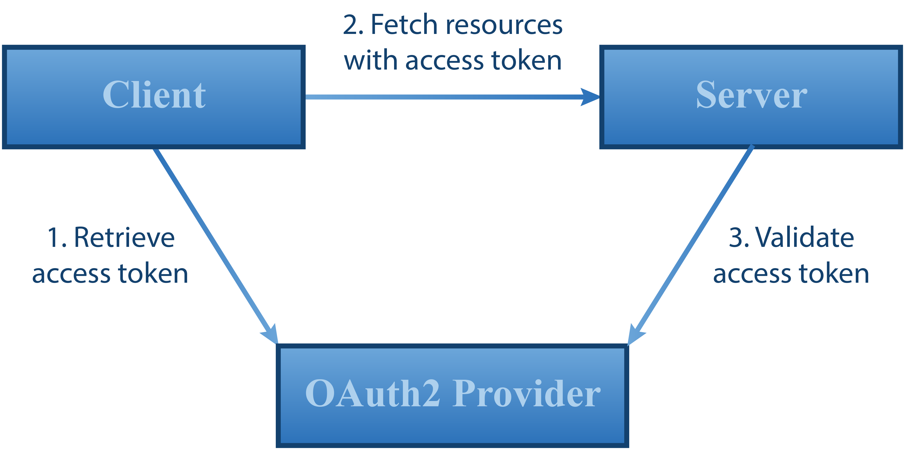

# OAuth2 Authorization Proxy Server Spring Boot


[](https://circleci.com/gh/szgabsz91/workflows/oauth2-authorization-proxy-server-spring-boot)
[](https://github.com/szgabsz91/oauth2-authorization-proxy-server-spring-boot/blob/master/LICENSE)

The `oauth2-authorization-proxy-server-spring-boot` project is an easy way to secure REST API endpoints in a Spring Boot
applications using the reactive Spring Webflux stack.

> Note that this project is not production ready, it is only an easy way to implement authentication and authorization
> for a server-side Spring Boot application using delegated OAuth2. With just a few lines of code one can secure REST
> API endpoints and experiment with client-side technologies that consume these API endpoints.

The core concept behind this project is that OAuth2 access token verification is delegated to external
OAuth2 providers like Facebook or Google. This way the implementation of access token creation and verification is the
responsibility of the external OAuth2 providers.

Currently only the OAuth2 implicit flow is tested, because the main goal is to make sure that developers can
experiment with various client-side technologies consuming secured REST API endpoints:

<p align="center">
    
</p>

Clients can authenticate themselves by providing two HTTP headers:

* `X-OAuth2-Provider`: identifies the external OAuth2 provider that should be used for access token verification.
* `Authorization`: contains a bearer access token that should be verified by the external OAuth2 provider.

For example, based on the following headers, `oauth2-authorization-proxy-server-spring-boot` will contact Facebook to
verify the access token *token1*. Facebook will then decide if the access token is valid or not, and either an HTTP
error 401 will be sent to the client or the authentication context will be built up using the user data provided by
Facebook.

```
X-OAuth-Provider: Facebook
Authorization: Bearer token1
```

## Quick Start

In a typical Spring Boot application, you can depend on the `oauth2-authorization-proxy-server-spring-boot-starter`
artifact that will create all the necessary Spring beans automatically using the Spring Boot autoconfiguration
mechanism.

Gradle:

```groovy
dependencies {
    implementation("com.github.szgabsz91:oauth2-authorization-proxy-server-spring-boot-starter:${oauth2AuthorizationProxyVersion}")
}
```

Maven:

```xml
<dependency>
    <groupId>com.github.szgabsz91</groupId>
    <artifactId>oauth2-authorization-proxy-server-spring-boot-starter</artifactId>
    <version>${oauth2-authorization-proxy.version}</version>
</dependency>
```

Note that the actual external OAuth2 providers will be only instantiated if their related configuration properties are
present. This way if you want to use only Facebook and not Google, you can omit the configuration properties of Google
and it won't be used.

The currently supported external OAuth2 providers and their related configuration properties are the following:

| External OAuth2 provider | Configuration property                                                   |
|--------------------------|--------------------------------------------------------------------------|
| Google                   | `oauth2.authorization.proxy.server.springboot.providers.google.clientId` |

## Details

For more details, see the readme of the subprojects:

* [core](core)
* [providers](providers)
* [providers/api](providers/api)
* [providers/google](providers/google)
* [starter](starter)

## Contribution

Everybody is encouraged to create new feature requests or even implement the already precategorized tickets in the
issue tracker.

If you find a bug or have some ideas about cool new features, don't hesitate!

* Search among the
    [open tickets](https://github.com/szgabsz91/oauth2-authorization-proxy-server-spring-boot/issues)
    if your bug or feature request is already tracked.
* If you don't find it,
    [open a new issue](https://github.com/szgabsz91/oauth2-authorization-proxy-server-spring-boot/issues/new).
* Wait until the issue is precategorized.
* If there is a
    *[help wanted](https://github.com/szgabsz91/oauth2-authorization-proxy-server-spring-boot/labels/help%20wanted)*
    label on the issue, feel free to implement it and open a pull request.
